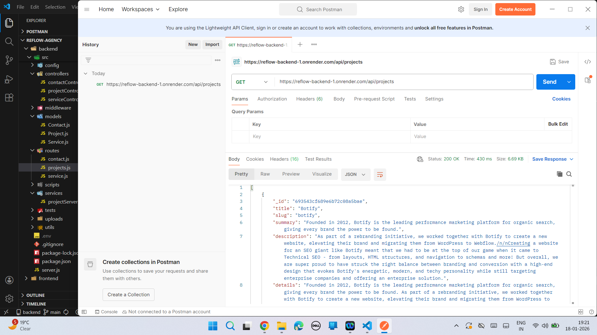
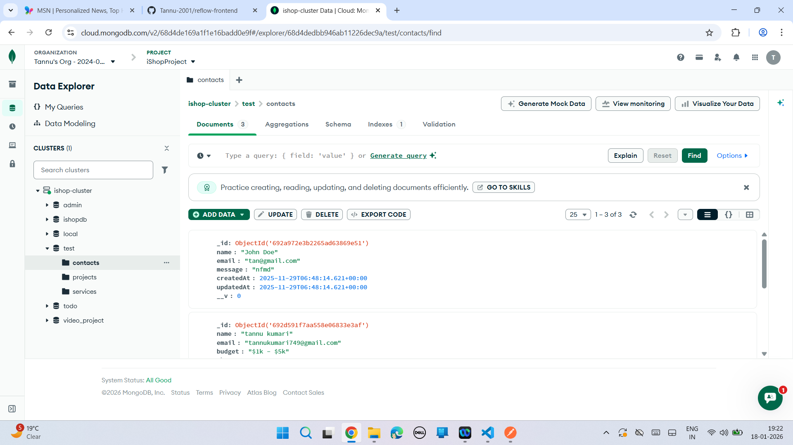
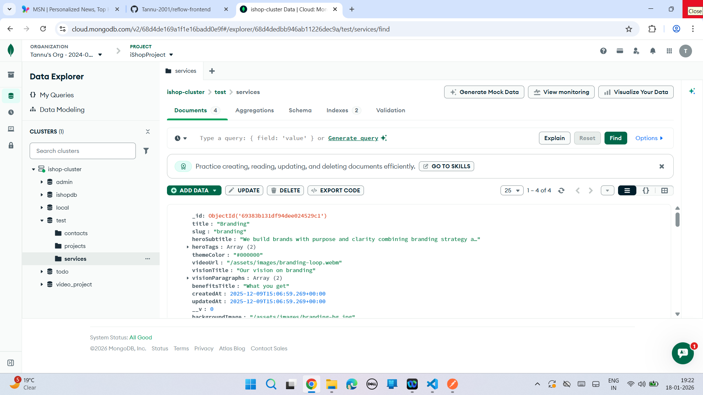
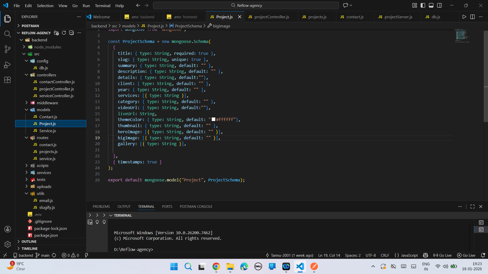

Reflow Backend is a RESTful API built to power the Reflow portfolio website, handling projects, services, and contact form submissions.

## Live API
https://reflow-backend-1.onrender.com

## Tech Stack
- Node.js
- Express.js
- MongoDB
- Mongoose
- CORS
- dotenv

## API Features
- Projects API (CRUD ready)
- Services API
- Contact form submission API
- MongoDB database integration
- Centralized error handling
- CORS-enabled for frontend deployment
- Deployed on Render

## What I Learned
- REST API architecture
- MongoDB schema design
- Environment-based configuration
- Backend deployment on Render
- CORS handling for production

## Run Locally

- git clone <https://github.com/Tannu-2001/reflow-backend>
- cd reflow-backend
- npm install
- npm start

## Environment Variables
Create a .env file:
PORT=5000
JWT_SECRET=your_jwt_secret_here

## API Endpoints
Http
- GET    /api/projects
- GET    /api/projects/:id
- POST   /api/contact
- GET    /api/services

## Screenshots
### Get Projects API

### Database Contact Collection

### Database Service Collection

### Folder Structure

## Future Improvements
Admin authentication
Full CRUD dashboard
Email notifications
Rate limiting & security hardening
